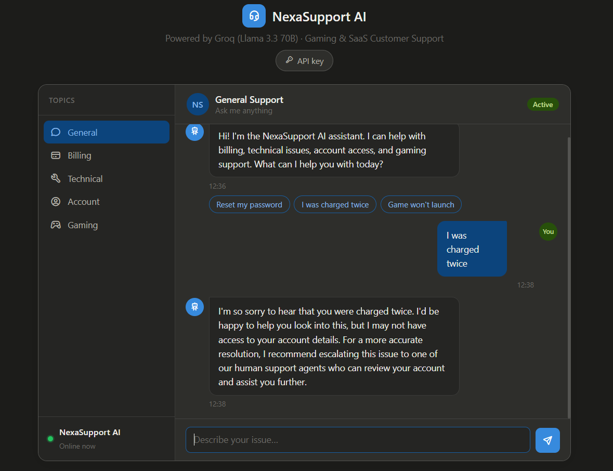

# NexaSupport AI — AI Customer Support Assistant

A live, AI-powered customer support chat assistant built for gaming and SaaS support workflows — categorized help topics, contextual conversation, and automatic escalation detection, powered by the Groq API running Llama 3.3 70B.

**Live demo:** https://thamimhayath.github.io/ai-customer-support-assistant



## Why I built this

Six years of resolving 100+ support tickets a day across billing, technical, account, and gameplay categories showed me how much of a first response is pattern-based — the right tone, the right triage question, the right escalation call. NexaSupport AI is a working prototype of that first layer: a categorized AI assistant that greets a customer in the right context, asks the right follow-ups, and flags when a case needs a human agent — the same shape of workflow this role runs at scale, built as a real, running tool instead of a static case study.

## Features

- **Five support categories** — General, Billing, Technical, Account, and Gaming — each with its own greeting, suggested quick-replies, and system prompt context
- **Conversational memory** — the assistant keeps context within a session so follow-up questions make sense
- **Automatic escalation detection** — when the model's reply signals it can't fully resolve an issue, the UI surfaces a "connecting you to a human agent" banner
- **Bring-your-own API key** — no backend, no server costs, and no shared key baked into the code; each visitor supplies their own free Groq key, stored only in their browser
- **Light/dark mode** — follows the visitor's OS preference automatically

## Tech stack

- Vanilla HTML, CSS, and JavaScript — no build step, no framework
- [Groq API](https://console.groq.com/) running Llama 3.3 70B for chat completions
- Browser `localStorage` for API key persistence (never sent to any server but Groq's)
- Deployed as a static site via GitHub Pages

## Getting started

1. Clone or download this repo
2. Open `index.html` in a browser — or visit the [live demo](https://thamimhayath.github.io/ai-customer-support-assistant)
3. Click **API key** in the header and paste in a free Groq key from [console.groq.com/keys](https://console.groq.com/keys)
4. Pick a support category and start chatting

No installation, dependencies, or backend required — it's a single static HTML file.

## A note on API key security

Earlier versions of this project had a Groq API key hardcoded directly in the client-side JavaScript. That's a real mistake worth naming, not hiding: any static site's source is fully visible to visitors, and both GitHub's secret scanning and Groq's own monitoring detect exposed keys in public repos and revoke them automatically — which is exactly what kept happening here.

The fix was to remove any embedded key entirely and switch to a bring-your-own-key model: each visitor enters their own free Groq key, which is stored only in their browser's `localStorage` and sent directly to Groq's API — never through any server or code of mine. It's a small trade-off in demo friction for a project that's actually safe to leave public.

The more robust long-term fix — worth calling out for anyone extending this — is routing the API call through a lightweight backend (a Cloudflare Worker or Vercel serverless function) that holds the key server-side, so visitors never need one of their own. That's on the roadmap below.

## Project structure

```
ai-customer-support-assistant/
├── index.html      # entire app — markup, styles, and logic
├── screenshot.png  # demo screenshot (add your own)
└── README.md
```

## Roadmap / possible next steps

- [ ] Serverless proxy (Cloudflare Worker / Vercel function) to remove the bring-your-own-key requirement
- [ ] Persist conversation history across page reloads
- [ ] Sentiment-based escalation scoring instead of keyword matching
- [ ] Exportable transcript for handoff to a human agent

## Author

**Thamim M** — Senior Technical Support & Customer Success
[Portfolio](https://thamim.online) · [LinkedIn](https://www.linkedin.com/in/thamim-m-mtech/) · [GitHub](https://github.com/thamimhayath)
